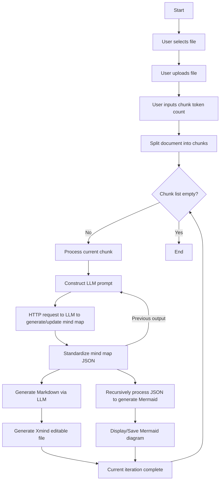

# File_2_MindMap
An enhanced web application based on the [MindMapper](https://github.com/misbahsy/MindMapper) that generates interactive mind maps from uploaded files by LLM.
Upload and chunk files, make POST requests to Aliyun to obtain LLM output, then generate markdown and visualize mind maps with Mermaid.

## Features
- Support local file uploads to generate mind maps (New)
- Output markdown source text for copying (New)
- Support PDF and DOCX document chunking with customizable chunk length limits (New)
- Iteratively generate mind maps based on chunks to handle model context window limitations (New)
- Interactive mind map visualization using Mermaid.js
- Download mind maps as PNG images for sharing
- Modern UI built with Next.js and Shadcn UI

## Prerequisites

- Node.js 18.0.0 or later
- Prepare your own api key in the next.config.ts, or use your local model
- Prepare your own prompts in the systemPrompts.ts

## Demo Screenshots
### Browser Interface

### Xmind Example (Future of Procurement)


## Getting Started

1. Clone the repository:

```bash
git https://github.com/yourusername/File_2_MindMap.git
cd File_2_MindMap
```

2. Install dependencies:

```bash
npm install
```

3. Start the development server:

```bash
npm run dev
```

4. Open [http://localhost:3000](http://localhost:3000) in your browser.

## API Configuration
This project uses Alibaba Cloud's API to call LLM services. If you have your own API approach, remember to modify the generateMindMap and convertToMarkdown functions in api.ts.

## Usage

1. Upload files (.pdf or .docx)
2. Enter document chunk token count (default: 10000)
3. Click "Generate Mind Map"
4. Left panel outputs Markdown text that can be copied into Xmind for editable mind maps
5. Right panel displays Mermaid mind map. Download as PNG using the Download button

## Technologies Used

- [Next.js](https://nextjs.org/)
- [React](https://reactjs.org/)
- [TypeScript](https://www.typescriptlang.org/)
- [Tailwind CSS](https://tailwindcss.com/)
- [Shadcn UI](https://ui.shadcn.com/)
- [Mermaid.js](https://mermaid-js.github.io/mermaid/)
- [html-to-image](https://github.com/bubkoo/html-to-image)
- [pdf.js](https://github.com/mozilla/pdf.js/)

## License

This project is licensed under the MIT License - see the LICENSE file for details.

## Flow chat

